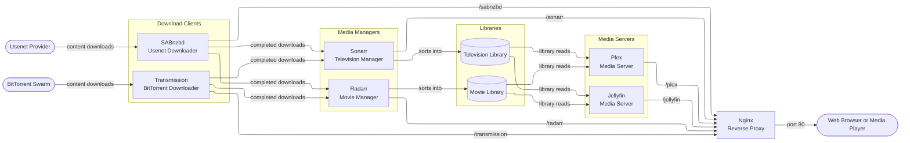

# Bragi

```
                        ᛒ  ᚱ  ᚨ  ᚷ  ᛁ
      ██████╗ ██████╗  █████╗  ██████╗ ██╗
      ██╔══██╗██╔══██╗██╔══██╗██╔════╝ ██║
      ██████╔╝██████╔╝███████║██║  ███╗██║
      ██╔══██╗██╔══██╗██╔══██║██║   ██║██║
      ██████╔╝██║  ██║██║  ██║╚██████╔╝██║
      ╚═════╝ ╚═╝  ╚═╝╚═╝  ╚═╝ ╚═════╝ ╚═╝
                    Media Server
```

Named for the Norse god of poetry and music — the skald of Valhalla, who played the golden harp for the gods — Bragi is a self-hosted media server solution that downloads, organizes, and plays your movie and television collection. It assembles seven containerized services, and wires them together into a single coherent system managed by systemd.

## How It Works

Bragi's services form a pipeline from download to playback:



1. **SABnzbd** connects to your Usenet provider and handles Usenet downloads
2. **Transmission** connects to the BitTorrent swarm and handles torrent downloads
3. **Sonarr** tracks television series releases, sends download requests to SABnzbd and Transmission, and sorts completed downloads into your television library
4. **Radarr** tracks movie releases, sends download requests to SABnzbd and Transmission, and sorts completed downloads into your movie library
5. **Jellyfin** reads your television and movie libraries and presents them as a streaming server accessible from any browser, television app, or media player
6. **Plex** reads your television and movie libraries and presents them as a streaming server accessible from any browser, television app, or media player
7. **Nginx** acts as a reverse proxy, exposing all other services at a single IP address on port 80

All containers run on a shared Docker network (`bragi`) so they communicate by hostname without exposing ports to the host. Sonarr, Radarr, SABnzbd, Transmission, and Jellyfin are fully wired together during installation.

## Services

| Service      | Image                      | Proxy Path     | Port  |
|--------------|----------------------------|----------------|-------|
| Nginx        | `nginx`                    | `/`            | 80    |
| SABnzbd      | `linuxserver/sabnzbd`      | `/sabnzbd`     | 8080  |
| Transmission | `linuxserver/transmission` | `/transmission`| 9091  |
| Sonarr       | `linuxserver/sonarr`       | `/sonarr`      | 8989  |
| Radarr       | `linuxserver/radarr`       | `/radarr`      | 7878  |
| Jellyfin     | `jellyfin/jellyfin`        | `/jellyfin`    | 8096  |
| Plex         | `plexinc/pms-docker`       | `/plex`        | 32400 |

Each service runs as a Docker container and is registered as a systemd unit (`bragi.<name>`). Configuration is stored in `/opt/<name>/config/` and persists across container restarts and upgrades.

### Upgrading a Service

Pull the new image and restart — configuration is unaffected:

```bash
sudo docker pull linuxserver/sonarr:latest
sudo systemctl restart bragi.sonarr
```

## Prerequisites

- Linux with systemd (Ubuntu recommended)
- Docker installed and running
- User with sudo privileges (or root)

## Installation

Clone the repository and run the installer:

```bash
git clone https://github.com/evinowen/bragi.git
cd bragi
chmod +x install.sh
./install.sh
```

The installer will ask a few questions, then handle everything else automatically.

### What the Installer Asks

**Media directories** — six paths for television and movie storage:

| Prompt               | Purpose                                        |
|----------------------|------------------------------------------------|
| Television downloads | Where SABnzbd places television downloads      |
| Television staging   | Sonarr's temporary processing area             |
| Television library   | Sonarr's sorted library (Jellyfin reads this)  |
| Movie downloads      | Where SABnzbd places movie downloads           |
| Movie staging        | Radarr's temporary processing area             |
| Movie library        | Radarr's sorted library (Jellyfin reads this)  |

If any of these directories do not exist, the installer will offer to create them.

**Usenet credentials** — hostname, username, password, and whether to use SSL.

**SABnzbd max download speed** (optional) — leave blank for unlimited.

### What the Installer Does

Once you've answered the prompts, the installer:

1. Pulls all seven Docker images
2. Creates each container with the correct volume mounts, environment variables, and network configuration
3. Registers each container as a systemd service and enables it to start on boot
4. Starts all services and waits for them to become healthy
5. Configures Sonarr and Radarr: admin authentication, SABnzbd download client, root folders, remote path mappings, and Usenet indexers
6. Configures Jellyfin: admin user, Television and Movies media libraries, and base URL for the Nginx proxy
7. Prints all service URLs and generated admin credentials

## Managing Services

All services run as `bragi.<name>` systemd units:

```bash
# Start / stop / restart
sudo systemctl start   bragi.jellyfin
sudo systemctl stop    bragi.jellyfin
sudo systemctl restart bragi.jellyfin

# Check status
sudo systemctl status bragi.jellyfin

# Enable / disable autostart on boot
sudo systemctl enable  bragi.jellyfin
sudo systemctl disable bragi.jellyfin
```

Available names: `nginx`, `sabnzbd`, `transmission`, `sonarr`, `radarr`, `jellyfin`, `plex`

To view logs:

```bash
sudo journalctl -u bragi.sonarr -f
docker logs bragi.sonarr
```

## Deploy Script

`deploy/` contains a TypeScript script that provisions a fresh Google Cloud Platform Compute Engine virtual machine, runs the full installer non-interactively using `expect`, and verifies that all services pass health checks. It is used for end-to-end testing of the installer against a clean Ubuntu environment.

### Prerequisites

[Node.js](https://nodejs.org/) 22 and the [gcloud CLI](https://cloud.google.com/sdk/docs/install) must be installed and authenticated.

```bash
cd deploy
nvm use        # if using nvm
npm install
```

### Configuration

Create `deploy/deploy.json` (excluded from version control — do not commit it):

```json
{
  "gcp_project_id": "your-project-id",
  "gcp_zone": "us-west1-a",
  "setup_firewall": true,
  "skip_cleanup": false,
  "services": {
    "radarr": false
  },
  "sabnzbd": {
    "max_download_speed": ""
  },
  "usenet": {
    "host": "news.example.com",
    "username": "youruser",
    "password": "yourpassword",
    "ssl": true
  },
  "indexers": [
    {
      "name": "MyIndexer",
      "url": "https://api.myindexer.com",
      "api_key": "abc123",
      "television": true,
      "movies": true
    }
  ]
}
```

See `deploy/deploy.json.example` for a complete example with all optional fields.

#### Top-level fields

| Field              | Description                                                                              |
|--------------------|------------------------------------------------------------------------------------------|
| `gcp_project_id`   | Google Cloud Platform project to create the test virtual machine in                      |
| `gcp_zone`         | Compute Engine zone (for example, `us-west1-a`)                                          |
| `gcp_machine_type` | Machine type (default: `e2-standard-2`)                                                  |
| `setup_firewall`   | Create firewall rules for SSH and HTTP on first run                                      |
| `skip_cleanup`     | Set to `true` to leave the virtual machine running after the test (useful for debugging) |
| `services`         | Object controlling which services are installed; each key is a service name set to `false` to disable it — services omitted from this object default to enabled |

#### `usenet`

| Field      | Description                              |
|------------|------------------------------------------|
| `host`     | Usenet provider hostname                 |
| `username` | Account username                         |
| `password` | Account password                         |
| `ssl`      | `true` to connect over SSL (recommended) |

#### `sabnzbd`

| Field                | Description                                                                        |
|----------------------|------------------------------------------------------------------------------------|
| `max_download_speed` | Cap download speed (for example, `100M`, `1G`); omit or leave empty for unlimited |

#### `indexers`

Each entry configures a Newznab-compatible indexer in Sonarr, Radarr, or both:

| Field              | Required | Description                                                   |
|--------------------|----------|---------------------------------------------------------------|
| `name`             | yes      | Display name for the indexer                                  |
| `url`              | yes      | Indexer base URL (for example, `https://api.nzbgeek.info`)    |
| `api_key`          | yes      | API key; use `""` for indexers that don't require one         |
| `television`       | yes      | `true` to add this indexer to Sonarr                          |
| `movies`           | yes      | `true` to add this indexer to Radarr                          |
| `api_path`         | no       | API endpoint path (default: `/api`)                           |
| `categories`       | no       | Newznab category IDs to search; overrides the service default |
| `anime_categories` | no       | Anime-specific category IDs for Sonarr (default: `[]`)        |

**Default categories** when `categories` is not specified:
- Sonarr: `[5030, 5040]` (TV/SD, TV/HD)
- Radarr: `[2000, 2010, 2020, 2030, 2040, 2045, 2050, 2060]` (all Movies subcategories)

#### Newznab Category Reference

| ID   | Category       | ID   | Category       |
|------|----------------|------|----------------|
| 2000 | Movies         | 5000 | TV             |
| 2010 | Movies/Foreign | 5010 | TV/WEB-DL      |
| 2020 | Movies/Other   | 5020 | TV/Foreign     |
| 2030 | Movies/SD      | 5030 | TV/SD          |
| 2040 | Movies/HD      | 5040 | TV/HD          |
| 2045 | Movies/UHD     | 5045 | TV/UHD         |
| 2050 | Movies/BluRay  | 5050 | TV/Other       |
| 2060 | Movies/3D      | 5060 | TV/Sport       |
|      |                | 5070 | TV/Anime       |
|      |                | 5080 | TV/Documentary |

### Running the Deploy Script

```bash
cd deploy
npm run deploy
```

The script prints service URLs and generated admin credentials when it completes. With `skip_cleanup: true`, the virtual machine stays running so you can log in and inspect the result. Delete it manually when done:

```bash
gcloud compute instances delete <instance-name> --zone=<zone> --project=<project-id>
```

## Troubleshooting

**Docker not installed**

Follow the official guide: https://docs.docker.com/engine/install/

**Docker daemon not running or permission denied**

```bash
sudo systemctl start docker
sudo usermod -aG docker $USER && newgrp docker
```

**A service failed to start**

```bash
sudo systemctl status bragi.<name>
docker logs bragi.<name>
```

**Jellyfin not accessible at `/jellyfin`**

Jellyfin takes up to two minutes to fully initialize on first start. If the proxy returns a 404, wait a moment and reload. If the issue persists, check that `bragi.jellyfin` is active and that the base URL is set to `/jellyfin` in Jellyfin's network settings.
